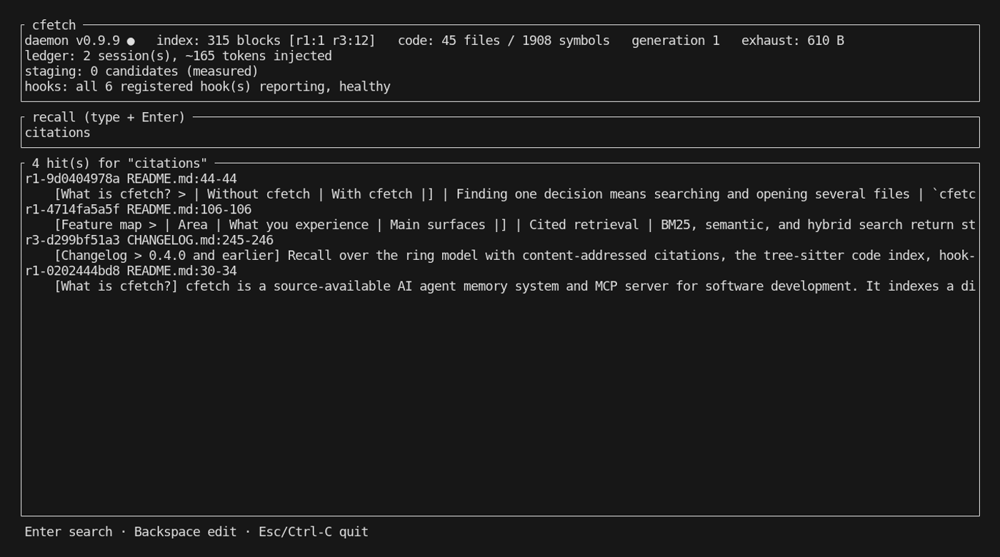

<h1 align="center">cfetch</h1>

<p align="center">
  <strong>Local-first memory and context control for AI coding agents.</strong>
</p>

<p align="center">
  Give Claude Code, Codex, Gemini, Cursor, and MCP clients one durable memory:<br />
  cited Markdown recall, exact code navigation, session continuity, automatic capture,<br />
  context-cost measurement, and cross-machine access from a single Rust binary.
</p>

<p align="center">
  <a href="https://github.com/corbet-labs/cfetch/actions/workflows/ci.yml"></a>
  <a href="https://github.com/corbet-labs/cfetch/releases/latest"></a>
  <a href="https://crates.io/crates/cfetch"></a>
  <a href="LICENSE.md"></a>
</p>

<p align="center">
  <a href="#terminal-dashboard">Dashboard</a> ·
  <a href="#feature-map">Feature map</a> ·
  <a href="#benchmarks">Benchmarks</a> ·
  <a href="#openwolf-openwolf-enhanced-and-cfetch">OpenWolf comparison</a> ·
  <a href="#installation">Installation</a> ·
  <a href="#configuration">Configuration</a>
</p>

## What is cfetch?

cfetch is a source-available AI agent memory system and MCP server for software
development. It indexes a directory of ordinary Markdown files, retrieves the
most relevant statements with stable citations, maps source code to exact
symbols and line ranges, and connects that context to coding agents through
native hooks, instructions, MCP, or the command line.

Your Markdown remains the source of truth. Search databases, vector caches,
and daemon state are derived or disposable; capture and usage streams remain
inspectable files. cfetch does not require a hosted memory service, a
proprietary database, or a change to how you edit your notes.

| Without cfetch | With cfetch |
|---|---|
| A new agent session starts cold | A small, scoped memory digest arrives at session start |
| Finding one decision means searching and opening several files | `cfetch recall` returns ranked statements with file, line, and trust-aware citations |
| Finding one function can pull an entire file into context | `cfetch find` returns the exact symbol range and an estimated token cost |
| Large command output occupies every later model turn | Safe output families are condensed; the complete original remains available |
| Context compaction drops in-flight knowledge | cfetch restores the session's modified-file record and relevant reminders |
| Hooks can fail silently | Heartbeats, transcript verification, `status`, and `selfcheck` expose the gap |
| Every machine builds a private, potentially stale copy | A storage machine can serve fresh, generation-stamped answers to thin clients |

## Terminal dashboard



`cfetch dashboard` makes the memory layer visible in one place: daemon and hook
health, catalog generation, statements by trust ring, indexed code, captured
exhaust, staged maintenance candidates, injected context, and live cited recall.
The screenshot is the shipped v0.9.9 dashboard indexing this repository, not a
UI mockup. The current dashboard is read-only; the CLI and MCP surfaces perform
the underlying actions.

## Feature map

Everything below is available in cfetch 0.9.9. Optional semantic search and
reranking require an OpenAI-compatible inference endpoint; lexical recall,
code navigation, hooks, capture, and measurement do not.

| Area | What you experience | Main surfaces |
|---|---|---|
| Persistent agent memory | Decisions, rules, notes, and working state stay in plain Markdown and git | `cfetch init`, configurable knowledge tree |
| Cited retrieval | BM25, semantic, and hybrid search return statement-level citations that survive file reordering | `recall`, `recall --semantic`, `recall --hybrid`, `recall --id` |
| Retrieval quality | Trust-aware ranking, optional cross-encoder reranking, lexical precision gates, duplicate suppression, and wikilink expansion | `recall --expand`, `rerank.*`, `recall.gate` |
| Code intelligence | Tree-sitter symbols, exact line ranges, import-graph importance, and token-budgeted repository maps | `find`, `map`, `.cfetchignore` |
| Session continuity | Scoped startup memory, periodic rule refresh, modified-file recovery after compaction, and known-failure lookup | hooks, `failures` |
| Context control | Repeat-read guidance, large-file slice hints, token-capped answers, and structural command-output condensation | native tool hooks, `--budget-tokens` |
| Learning loop | Redacted session activity is captured, deterministic signals flag useful candidates, and unreviewed material stays quarantined | `staging list`, `staging consume`, `staging dismiss` |
| Honest measurement | Transcript-derived usage, cfetch's own injection cost, rewrite-point savings, cache-rebuild attribution, and paired A/B analysis | `audit`, `bench`, dashboard |
| Reliability | A warm daemon, incremental scanning, hook heartbeats, delivery verification, and fail-open hook behavior | `daemon`, `status`, `selfcheck` |
| Agent integrations | Capability-detected native hooks, MCP registration, and recall-first instruction blocks across common coding agents | `install`, `install --agent`, `mcp` |
| Multi-machine access | Storage hosts serve bounded, freshness-labeled queries; clients can hold no local index | serving daemon, drain barrier |
| Selective sharing | Nested slices, authenticated host identities, one-time invites, and per-slice grants | `slices`, `identity`, `invite`, `join`, `grants` |
| Privacy and safety | Secret-shaped files are excluded, `<private>` regions are blanked before indexing, and hooks never approve tools | built-in boundaries, local state |
| Cross-platform delivery | Linux, macOS, and Windows block releases; packages are available through Cargo, Homebrew, Nix, AUR, and release archives | `variants`, `hardware` |

## Benchmarks

cfetch measures output reduction where the rewrite happens, retaining both the
original and model-facing sizes. With the v0.9.9 release binary, 13 real command
outputs from the public cfetch and dotkeeper repositories produced these results:

| Measurement | Result |
|---|---:|
| Oversized outputs rewritten | 8 |
| Original size | 86,469 estimated tokens |
| Model-facing size, including preservation pointers | 5,702 estimated tokens |
| Context avoided | **80,767 estimated tokens (93.4%)** |
| Median reduction per rewritten output | **91.2%** |
| Short-output controls passed through unchanged | 4 of 4 |
| 2,150-line CI test-log control passed through unchanged | yes |

The benchmark deliberately selects oversized repository listings, search
results, and version-control history—the output families cfetch is designed to
condense. Token counts use cfetch's labeled characters/3.5 estimate; the byte
measurements themselves are taken from the real hook input and replacement.
Test and build output is never rewritten, because the useful failure can be in
the middle. Full inputs, commands, pinned commits, and per-case results are in
[the benchmark study](studies/context-reduction-v0.9.9.md).

This is an output-reduction result, not a whole-session savings claim. For that,
`cfetch bench` compares transcript-grounded cfetch and bare runs with identical
first prompts and refuses to report a paired delta below three task pairs.

## OpenWolf, OpenWolf Enhanced, and cfetch

cfetch was informed by the public behavior and lessons of
[OpenWolf 2.x](https://github.com/cytostack/openwolf#readme) and the separate
[OpenWolf Enhanced 1.x](https://github.com/bassprofressor-lab/openwolf-enhanced#readme)
lineage. It is an independent Rust implementation with a different storage,
deployment, trust, and sharing model.

This map answers the practical question: which ideas exist in each project,
and how are they experienced?

| Capability | OpenWolf 2.x | OpenWolf Enhanced 1.x | cfetch 0.9.9 |
|---|---|---|---|
| Memory scope | One `.wolf/` memory per project | One bounded `.wolf/` memory per project | Any Markdown tree, composed from nested slices |
| Session startup | Budgeted project digest and handoff | Smart resume digest and structured summaries | Budgeted, trust-aware, host/repository-scoped injection |
| Compaction survival | Restores state, rules, and scoped instructions | Carries the 1.x session state forward | Restores modified-file evidence and re-arms relevant guidance |
| Knowledge retrieval | Project index, symbol search, and bug search | BM25, semantic/hybrid recall, citations, and MCP | BM25, semantic/hybrid recall, reranking, citations, wikilinks, and slice filters |
| Code navigation | Symbol ranges and import-aware project map | `find`, optional tree-sitter ranges, and PageRank | Tree-sitter `find`, exact ranges, import graph, and token-fitted `map` |
| Context reduction | Repeat-read awareness, file-size hints, and Bash output governor | Same 1.x family plus bounded storage controls | Repeat-read guidance, slice hints, answer budgets, precision gate, and output condensation |
| Memory capture | Corrections, bug fixes, action log, and handoff files | Optional activity capture, bug memory, lint, and distillation | Redacted exhaust → deterministic flags → quarantined staging → deliberate promotion |
| Measurement | Real transcript usage, verified delivery, cache attribution, and A/B bench | Estimated ledger including its own injection cost | Transcript usage, rewrite deltas, injection cost, cache attribution, audit, and paired bench |
| Health and UI | Heartbeats, selfcheck, and token-authenticated web dashboard | Doctor, health checks, and expanded web dashboard | Heartbeats, truthful delivery state, selfcheck, status, and terminal dashboard |
| Agent reach | Full integration for Claude Code, Codex, and OpenCode; context for several others | Hooks for four agents plus MCP clients | Confirmed configuration surfaces across 25 harnesses; native hooks only where the payload contract is understood |
| Sharing | Git carries useful project state | Optional explicit push to a linked workspace | Authenticated serving and per-slice grants over iroh |
| Maintenance extras | Project update/restore, cron, and skills | Doctor, lint, distill, export, Design QC, and optional AI tasks | Supervised AI evidence review, typed proposals, exact diffs, reversible apply, and commit-gated promotion |
| Runtime | Node.js 20+, per-project hook files | Node.js 20+, per-project hook files | One Rust binary plus an optional per-host daemon |
| License | AGPL-3.0 | AGPL-3.0 | FSL-1.1-ALv2, converting to Apache-2.0 after two years |

cfetch keeps maintenance that can run deterministically inside the binary and
keeps judgment behind the staging boundary. Captured text cannot become trusted
memory without a deliberate review and promotion step.

## How cfetch works

### Plain Markdown is the record

The knowledge tree is the only fact store. The local SQLite catalog, symbol
index, fingerprints, and vector cache can be deleted and rebuilt without
losing knowledge. This also means ordinary editors, git history, Obsidian,
shell tools, and code review continue to work.

### Trust is visible in every citation

cfetch uses configurable rings to distinguish critical constraints from raw
session capture. A lower ring number means higher trust; the ring prefix is
part of every citation.

| Ring | Typical content | Default context behavior |
|---|---|---|
| 0 | Critical invariants and safety constraints | Eligible for explicit resident injection |
| 1 | Durable policy and settled decisions | Eligible for explicit resident injection |
| 2 | Distilled behavior and scoped guidance | Injectable only with an explicit scope |
| 3 | Curated knowledge and documentation | Retrieved on demand |
| 4 | Current tasks and working state | Retrieved on demand |
| 5 | Review candidates | Never recalled or injected implicitly |
| 6 | Redacted raw capture | Never recalled or injected implicitly |

Ring assignment defaults by path and can be overridden with `ring: N` in
frontmatter. Rings express trust, not authorization; slice grants control who
can access which content.

### AI maintenance crosses the trust boundary only with approval

cfetch turns maintenance into an inspectable transaction. A connected coding
agent can ask for a bounded evidence packet and submit a typed proposal, but
that proposal remains in ring 5: it is neither recalled nor injected. cfetch
then independently rechecks the source evidence, citation snapshots, authority,
target ring, current file hash, path safety, expiry, and secret-shaped content.

```console
$ cfetch staging list
$ cfetch maintain packet recurring-failure-a1b2c3d4
$ cfetch maintain submit --file proposal.json
$ cfetch maintain review maintenance-9f31d870ac42 --file review.json
$ cfetch maintain verify maintenance-9f31d870ac42
$ cfetch maintain apply maintenance-9f31d870ac42 --approval-token approve-...

# Review and commit the Markdown with normal git tooling, then:
$ cfetch maintain finalize maintenance-9f31d870ac42
```

Applying is explicit and reversible. The staging candidate is consumed only
after git `HEAD` contains the exact approved bytes. Ring 0 and ring 1 are never
maintenance targets, unendorsed model claims cannot cross inward, and an
attested observation may enter ring 3 but not behavioral ring 2. No daemon or
hook calls a model in the background; the active agent supplies the analysis
under the operator's existing model and approval policy. The terminal dashboard
shows pending and applied maintenance proposals alongside staging.

See [Supervised AI maintenance](docs/ai-maintenance.md) for the proposal schema,
lifecycle, failure behavior, and agent integration.

### Retrieval is layered, bounded, and explicit

Lexical BM25 recall works immediately. Semantic and hybrid search are optional,
use content-addressed vector artifacts, and report partial coverage instead of
quietly pretending to be semantic. An optional cross-encoder reranks the
retrieved shortlist. Every text answer has a token budget, so asking for ten
hits cannot unexpectedly fill the context window.

```console
$ cfetch recall --hybrid "request retry policy"
$ cfetch recall --slice engineering "deployment rollback"
$ cfetch recall --expand "database migration"
```

### Freshness is part of the answer

A machine holding the Markdown can serve recall, citation expansion, code
search, and repository maps to other machines. Every response carries an
origin, catalog generation, and `fresh` flag. Queries pass a bounded drain
barrier: cfetch either proves that visible writes have reached the catalog or
labels the answer stale and explains why.

```console
# Storage machine
$ cfetch daemon start

# Client configured with client.serving
$ cfetch recall "release checklist"
...
served by docs-host (generation 42, fresh)
```

## Agent integrations

`cfetch install` detects initialized agent configurations and adds only the
surfaces each agent actually supports. Entries are ownership-ledgered,
idempotent, backed up on first touch, and removed symmetrically with
`cfetch install --remove`.

```console
$ cfetch install                         # detected agents
$ cfetch install --agent claude --agent codex
$ cfetch install --project . --all       # confirmed project-local surfaces
```

Native hooks are capability-gated. Claude Code, Codex, and CodeBuddy receive
the full lifecycle where available; Gemini, iFlow, and Tabnine receive only
the verified tool-event subset. Other supported agents receive MCP and/or
recall-first instructions according to their confirmed configuration format.

<details>
<summary>Show the current adapter registry</summary>

```text
claude cursor gemini openclaw hermes codex copilot opencode cline roo
windsurf kilocode antigravity antigravitycli amp codebuddy crush forge
iflow junie pi qodercli qwen tabnine trae
```

</details>

For any MCP client, the manual registration is the standard stdio shape:

```json
{
  "mcpServers": {
    "cfetch": { "command": "cfetch", "args": ["mcp"] }
  }
}
```

The server exposes read-only `cfetch_recall`, `cfetch_expand`, `cfetch_find`,
`cfetch_maintenance_packet`, and `cfetch_maintenance_show` tools.
`cfetch_maintenance_propose` and `cfetch_maintenance_review` can write only
idempotent ring-5 records; apply, revert, reject, and finalize remain CLI-only
approval surfaces.

## Installation

### Package managers

```console
# Homebrew on macOS or Linux
brew tap corbet-labs/cfetch
brew install cfetch

# crates.io on any platform with Rust 1.95+
cargo install cfetch --locked

# Arch Linux (AUR package name avoids an unrelated cfetch package)
paru -S cfetch-agent

# Nix flake
nix profile install github:corbet-labs/cfetch
```

Prebuilt archives for Linux, macOS, and Windows are attached to
[GitHub releases](https://github.com/corbet-labs/cfetch/releases/latest).
Every archive includes the binary, cfetch license, generated third-party
notices, and embedded variant metadata. `cfetch variants` prints the exact
catalog used to build the release.

### Build the development branch

```console
$ git clone https://github.com/corbet-labs/cfetch.git
$ cd cfetch
$ cargo build --release
```

Linux, macOS, and Windows all gate releases in CI. Platform-specific local
control transport is hidden behind the same CLI: Unix sockets on Linux/macOS,
and authenticated loopback TCP on Windows.

## Configuration

cfetch searches for one JSON configuration in this order:

- `CFETCH_CONFIG`, when set;
- `<brain_root>/.cfetch/config.json` for tree-wide policy; then
- `~/.config/cfetch/config.json` on Linux/macOS or
  `%APPDATA%\cfetch\config.json` on Windows for host-specific settings.

The first existing file wins; configuration files are not layered. Missing
fields use built-in defaults.

Environment variables `CFETCH_BRAIN` and `CFETCH_STATE_DIR` override the
knowledge and local-state paths.

A compact starting point:

```json
{
  "brain_root": "/home/you/agent-memory",
  "resident": [
    { "path": "rules/critical.md", "ring": 0 },
    {
      "path": "guidance/rust.md",
      "ring": 2,
      "scope": { "repos": ["api-service"] }
    }
  ],
  "code_roots": ["projects"],
  "budget_chars": 6000,
  "exclude_prefixes": ["vendor/", "archive/", "scratch/"]
}
```

Ring rules are ordered; the first matching path prefix wins:

```json
{
  "ring_rules": [
    { "prefix": "rules/critical.md", "ring": 0 },
    { "prefix": "rules/", "ring": 1 },
    { "prefix": "guidance/", "ring": 2 },
    { "prefix": "tasks/", "ring": 4 },
    { "prefix": "staging/", "ring": 5 },
    { "prefix": "", "ring": 3 }
  ]
}
```

Semantic recall is off by default. Point it at an OpenAI-compatible embeddings
endpoint; keep the credential in an environment variable, never in JSON:

```json
{
  "embeddings": {
    "enabled": true,
    "endpoint": "http://127.0.0.1:8080/v1",
    "model": "embed-model",
    "dimensions": 1024,
    "precision": "f16",
    "api_key_env": "EMBEDDINGS_API_KEY"
  }
}
```

Then run `cfetch embed-index`. Vectors are keyed by the statement content hash,
so editing one file re-embeds only changed statements. Missing or partial vector
coverage is always reported.

Named slices limit recall and sharing by path:

```json
{
  "slices": [
    { "name": "engineering", "prefixes": ["knowledge/engineering"] },
    { "name": "backend", "prefixes": ["knowledge/engineering/backend"] }
  ]
}
```

Every document belongs to its innermost slice. Unknown slice names are refused
instead of widening to the whole tree.

Hard exclusions cannot be disabled: secret directories, logs, git internals,
and secret-shaped filenames never enter recall, and their paths are withheld
from capture. Configured `exclude_prefixes` and `.cfetchignore` add
project-specific boundaries.

## Frequently asked questions

### Does cfetch replace built-in agent memory?

No. It can index supported native memory read-only and adds a shared,
agent-independent retrieval and governance layer. You can run both without
duplicating resident injection.

### Does cfetch require a vector database or cloud service?

No. Lexical recall and code search are local and work without embeddings.
Semantic search can use a local or hosted OpenAI-compatible endpoint. The
per-host catalog is disposable SQLite; Markdown remains the record.

### Is cfetch only for Claude Code?

No. Claude Code and Codex have the deepest native integration, while other
agents connect through verified hook subsets, MCP, and instruction files.

### Is captured session text trusted automatically?

No. Capture is redacted and placed in ring 6. Deterministic signals may create
a ring-5 candidate, but neither ring is implicitly recalled or injected.
Promotion into curated memory is deliberate.

### Does cfetch use AI to maintain memory?

Yes, through a supervised agent session. One pass receives immutable evidence
references and current cited context, then proposes a typed transition: add,
fold, supersede, revalidate, dismiss, or no-op. A separate immutable review
checks coverage, faithfulness, preservation, authority, target choice, and
contradictions. cfetch then performs deterministic verification and requires an
explicit approval token before applying exact bytes. It never runs an
unattended model cron job, and MCP cannot promote a proposal into trusted
memory.

### How is cfetch different from OpenWolf?

OpenWolf centers a project-local `.wolf/` directory and Node.js lifecycle
hooks. cfetch centers an arbitrary Markdown tree, trust-aware citations,
token-bounded retrieval, a single Rust daemon, and authenticated slices that
can be served across machines. See the
[feature comparison](#openwolf-openwolf-enhanced-and-cfetch).

## Security

- Hooks never emit an automatic permission approval.
- Internal hook failures exit successfully and degrade to silence, so memory
  infrastructure cannot trap or break an agent session.
- Secret-shaped paths and private regions are filtered at collection time.
- Serving and Windows local control channels use bearer tokens and
  constant-time comparison.
- Configured URLs require HTTPS or loopback unless a host is explicitly
  allowed; redirects cannot carry credentials across the boundary.

Report suspected vulnerabilities through the private process in
[SECURITY.md](SECURITY.md).

## License and contributing

[FSL-1.1-ALv2](LICENSE.md): use, modify, and redistribute cfetch for any
purpose except offering a competing commercial product or service. Each
release converts automatically to Apache-2.0 two years after publication.

Contributions are welcome. Fork cfetch, send a focused pull request, and sign the
[Contributor Agreement](CLA.md) once. Accepted contributions join the coherently
licensed project through copyright assignment; contributors keep attribution and
a broad license back to their own work. Read
[CONTRIBUTING.md](CONTRIBUTING.md) and follow the clean-room rule: do not copy or
closely paraphrase code from OpenWolf, OpenWolf Enhanced, or other incompatibly
licensed projects.

Participation is governed by the [Code of Conduct](CODE_OF_CONDUCT.md).
